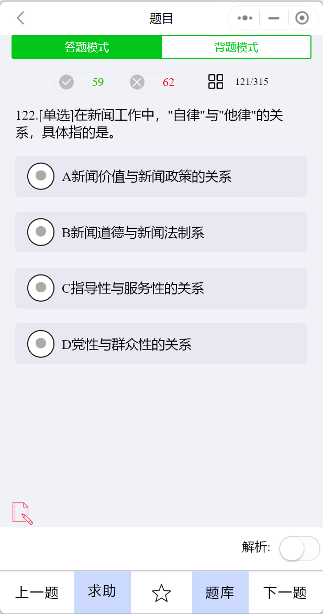
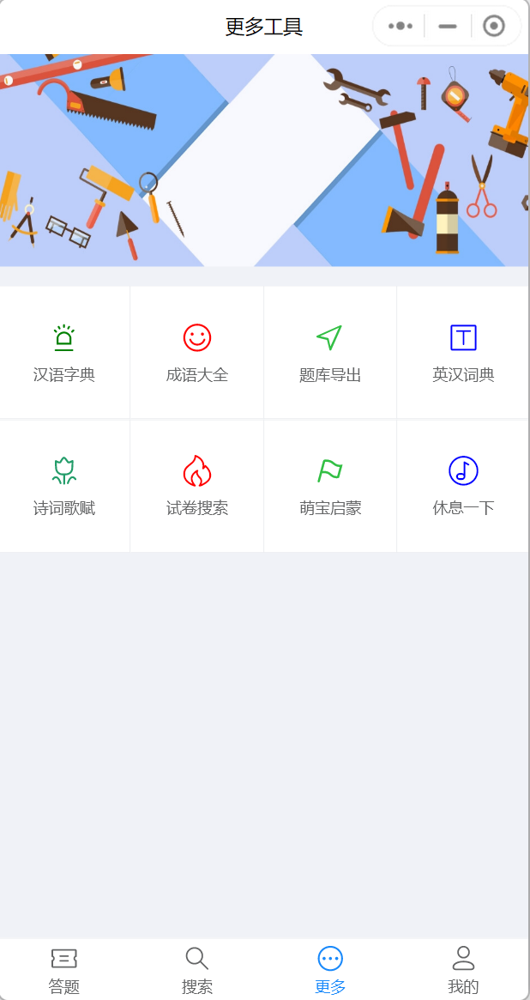
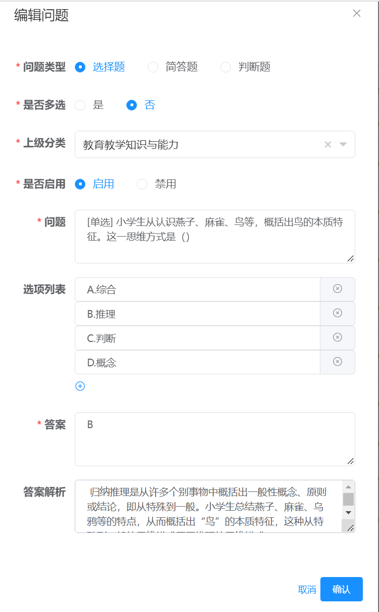
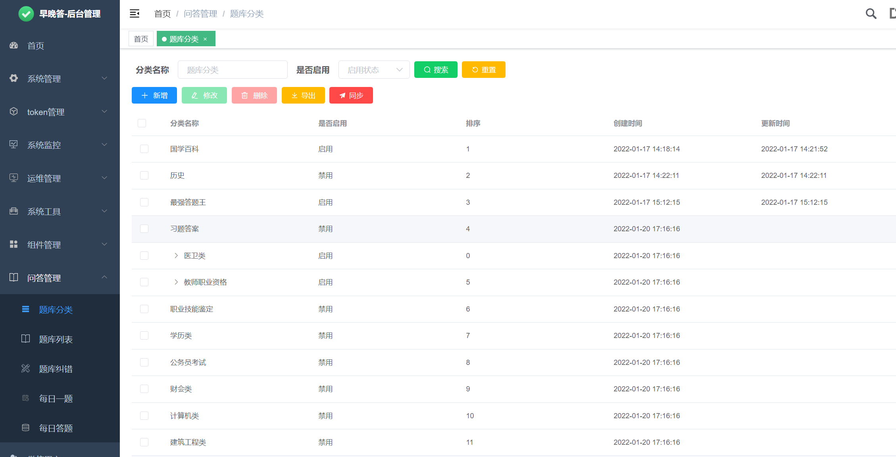
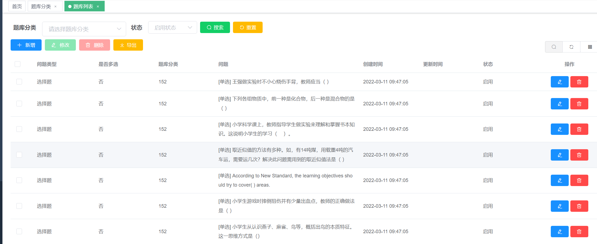
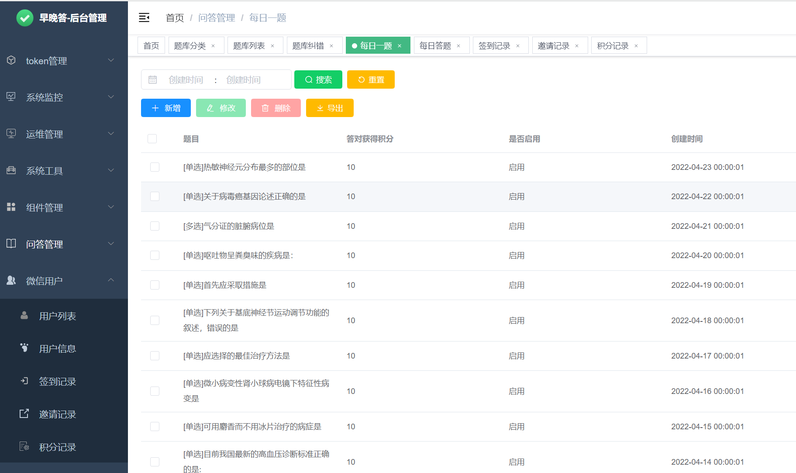

# 答题小程序

**develop是目前已上线的主分支，包含云函数版接口**

**master不再进行更新，不包含云函数，且存在数据权限问题**

#### 介绍
答题，题目解析，分享，模拟考试，排名，签到功能，获得积分

利用微信小程序方便进行答题操作

增加了汉字查询、成语查询、英汉词典等功能

交流 qq群：123955944

gitee地址 [https://gitee.com/siival/question](https://gitee.com/siival/question)

#### 扫码预览

#### 工具使用

> 小程序页面：微信小程序基础组件，vant开源组件

> 后端接口：java 开发，mysql数据库、部分数据使用云开发数据库

#### 待完成

1. ~~全唐诗的搜索~~(已完成)
2. ~~宋词的搜索~~(已完成)
3. 歇后语的搜索
4. 后台管理页面开发完善中
5. 后台sass版api接口开放

#### 代码运行

1. 将`utils/constant.js.example` 重命名为`constant.js`
2. `constant.js`里面配置后台接口地址和请求接口的`token`

#### 扫码添加QQ群讨论

#### 微信群

#### 页面截图

#### 后台截图

