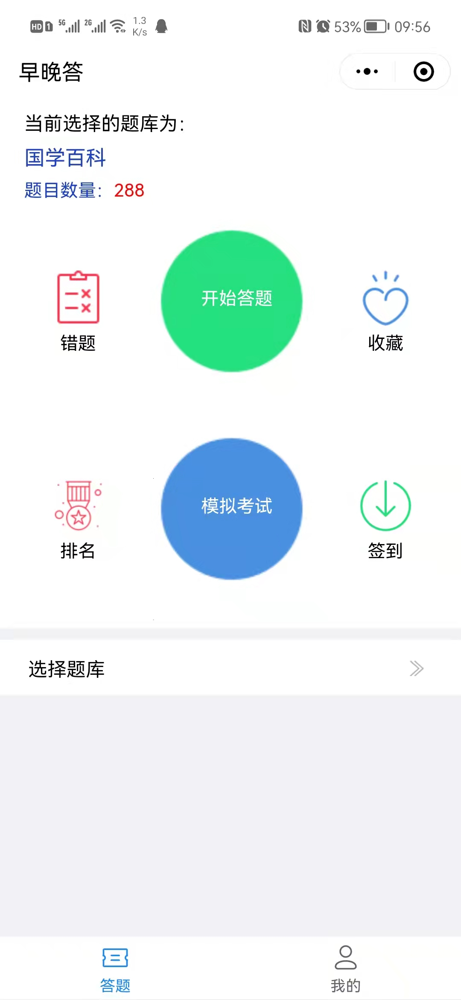
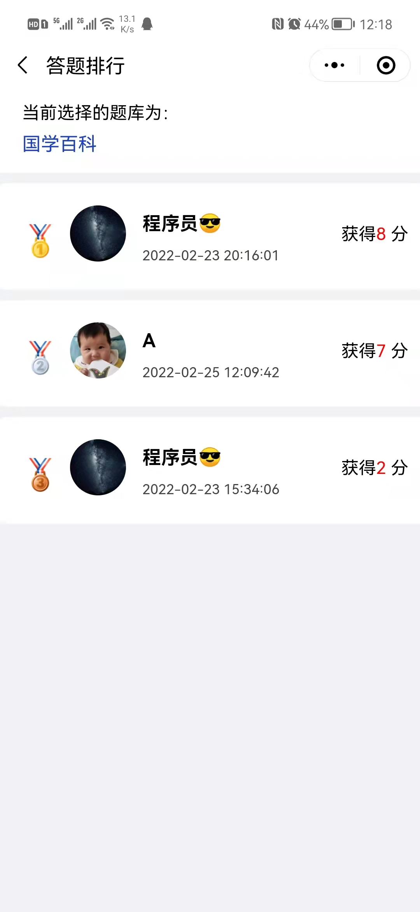
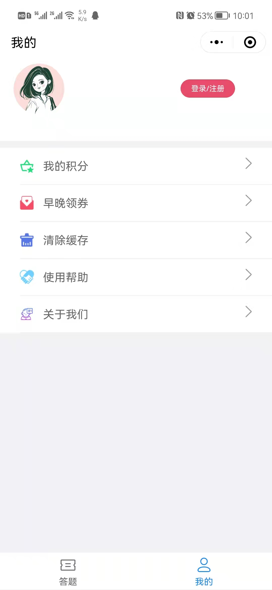
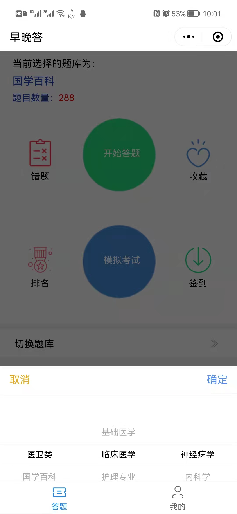
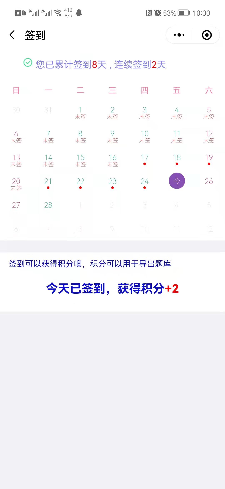
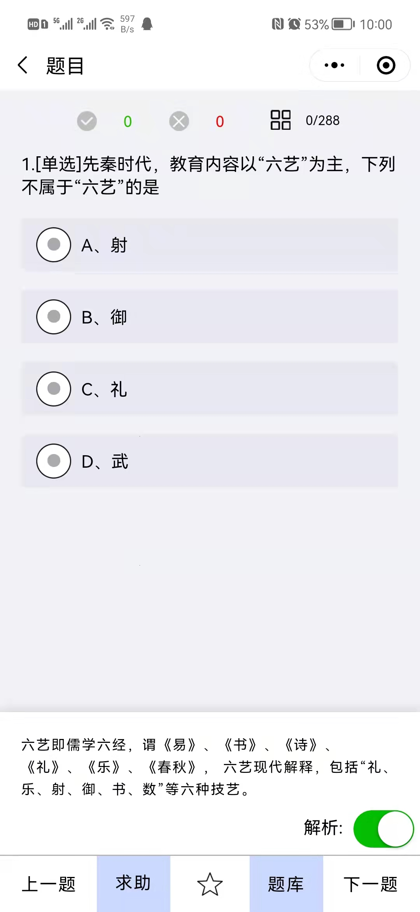
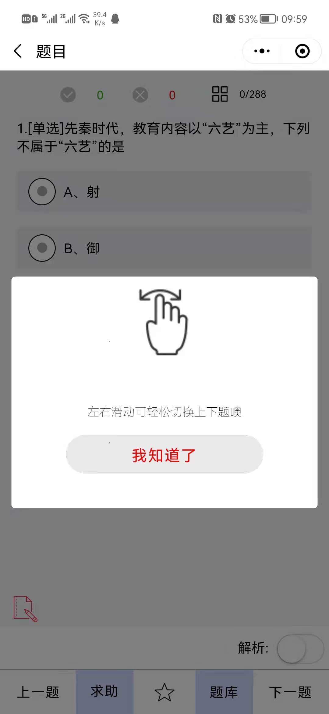
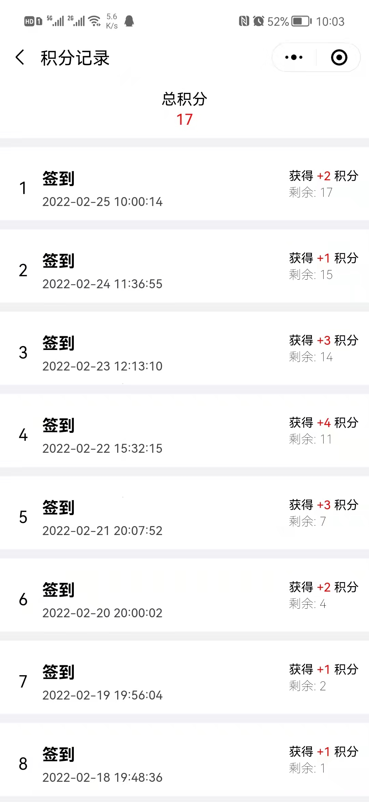
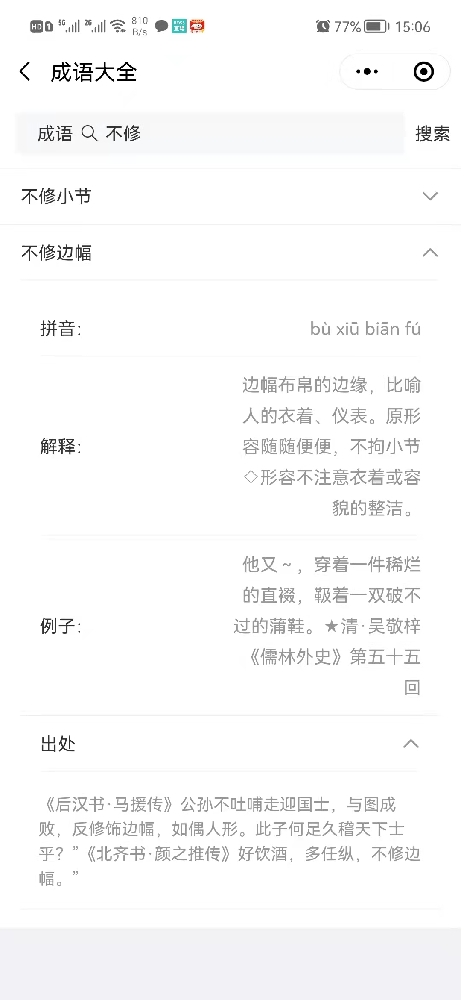
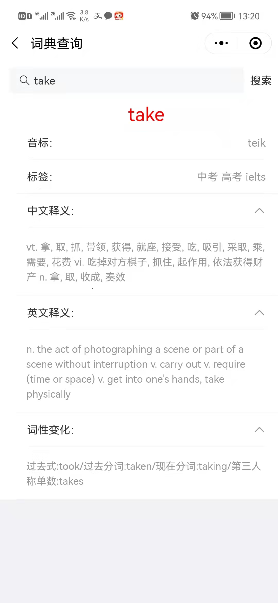

# 答题小程序

#### 介绍
答题，题目解析，分享，模拟考试，排名，签到功能，获得积分

利用微信小程序方便进行答题操作

增加了汉字查询、成语查询、英汉词典等功能

交流 qq群：123955944

#### 扫码预览

#### 工具使用

> 前端页面：微信小程序基础组件，vant开源组件

> 后端接口：java 开发，mysql数据库、部分数据使用云开发数据库

#### Change Logs 

 #####  2022.02.25 

  完成答题，模拟考试等功能，1.0.3版本上线 

##### 2022.03.06 

   增加词典、成语、英汉词典功能，上线2.0.0版本

#### 待完成

1. 全唐诗的搜索
2. 宋词的搜索
3. 歇后语的搜索
3. 其他行业题库整合

#### 扫码添加群讨论

#### 页面截图

