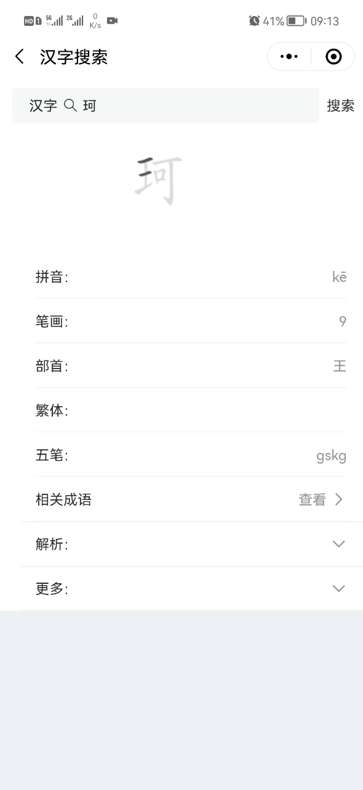
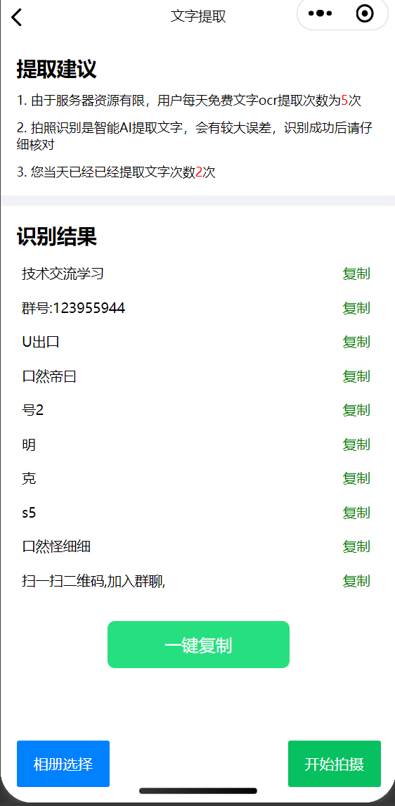
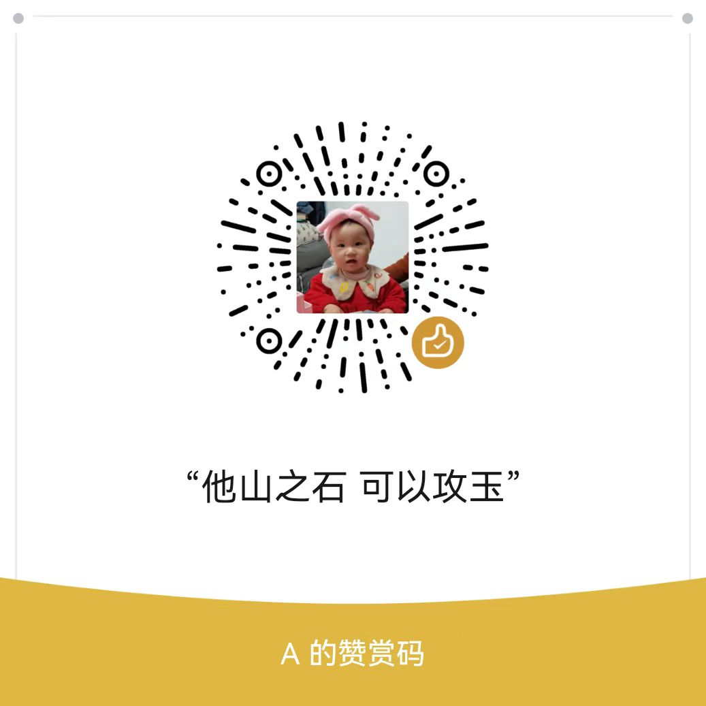

# 早晚答题小程序

**master是目前已上线的小程序主分支**

*develop 是开发分支，开发新功能，上线后合并到master分支* 

#### 介绍

答题，题目解析，分享，模拟考试，排名，签到功能，获得积分

利用微信小程序方便进行答题操作

增加了汉字查询、成语查询、英汉词典、诗词歌赋、萌宝启蒙等功能

增加了汉字笔画书写功能

交流 qq群：123955944

#### 扫码预览


#### 工具使用

> 小程序页面：微信小程序基础组件，vant开源组件

> 后端接口：java 开发，mysql数据库、部分数据使用云开发数据库

#### 接口文档

  后台接口文档 [http://docs.siival.com/](http://docs.siival.com/)

#### 待完成

1. ~~全唐诗的搜索~~(已完成)
2. ~~宋词的搜索~~(已完成)
3. 歇后语的搜索
4. 后台管理页面开发完善中
5. 后台sass版api接口开放

#### 代码运行

1. 将`utils/constant.js.example` 重命名为`constant.js`

2. `constant.js`里面配置后台接口地址和请求接口的`token`

3. 汉字笔画功能了修改npm包的源码，使用构建npm功能完成之后，找到构建后的`hanzi_witer/index.js`里面找到代码`_animationFrame`方法内容替换为下面代码：
   
   ```javascript
   var ctx = this._target.ctx
     if( ctx){
       ctx.clearRect(0, 0, this._positioner.width, this._positioner.height);
   
       ctx.save();
       ctx.translate(this._positioner.xOffset, this._positioner.height - this._positioner.yOffset);
       ctx.transform(1, 0, 0, -1, 0, 0);
       ctx.scale(this._positioner.scale, this._positioner.scale);
       func(ctx);
       ctx.restore();
       if (ctx.draw) ctx.draw();
     }else{
       let that = this
       const query =  wx.createSelectorQuery().in(this._target.view)
       query .select('#writer-canvas').fields({
         node:true
       }).exec(
         function(res){
           //
           let ctxnode = res[0].node
           let   ctx = ctxnode.getContext('2d')
   
           that._target.ctx = ctx;
           ctx.clearRect(0, 0, that._positioner.width, that._positioner.height);
   
           ctx.save();
           ctx.translate(that._positioner.xOffset, that._positioner.height - that._positioner.yOffset);
           ctx.transform(1, 0, 0, -1, 0, 0);
           ctx.scale(that._positioner.scale, that._positioner.scale);
           func(ctx);
           ctx.restore();
           if (ctx.draw) ctx.draw();
         });
     }
   ```

#### 扫码添加QQ群讨论

<a target="_blank" href="https://qm.qq.com/cgi-bin/qm/qr?k=oH2Uv8YJ5URz81DsRK-cZ-BpONQM6BRg&jump_from=webapi"></a>


#### 微信群


#### 页面截图







#### 后台截图


#### 参考项目

1. 汉字writer [https://github.com/chanind/hanzi-writer](https://github.com/chanind/hanzi-writer)

2. 汉字笔画write 小程序版 [https://github.com/chanind/hanzi-writer-miniprogram](https://github.com/chanind/hanzi-writer-miniprogram)

3. 日历插件 [https://github.com/treadpit/wx_calendar](https://github.com/treadpit/wx_calendar)

4. 抽奖大转盘 [https://github.com/xing00/wxapp-turn-table](https://github.com/xing00/wxapp-turn-table)

5. 三级联动 [https://github.com/z1511676208/chooseAddr](https://github.com/z1511676208/chooseAddr)

#### 赞赏项目

人都是要恰饭的。开源不易，请作者喝杯奶茶吧

微信赞赏



支付宝赞赏

