# 早晚答题小程序

**master是目前已上线的小程序主分支**

**miniprogram目录是小程序开发的内容，src是准备用uni-app重写的页面，写完后小程序目录会移除**

*develop 是开发分支，代码迁移到uni-app 并且全部用ai重写* 

#### 介绍

答题，题目解析，分享，模拟考试，排名，签到功能，获得积分

交流 qq群：123955944

#### 扫码预览

#### 工具使用

> uni-app 前端框架

> 后端接口：java 开发，mysql数据库

#### 后台接口

  关注微信公众号“技术成就自我”，回复关键字“后台”获得后台源码地址。

  

#### 扫码添加QQ群讨论

#### 微信群

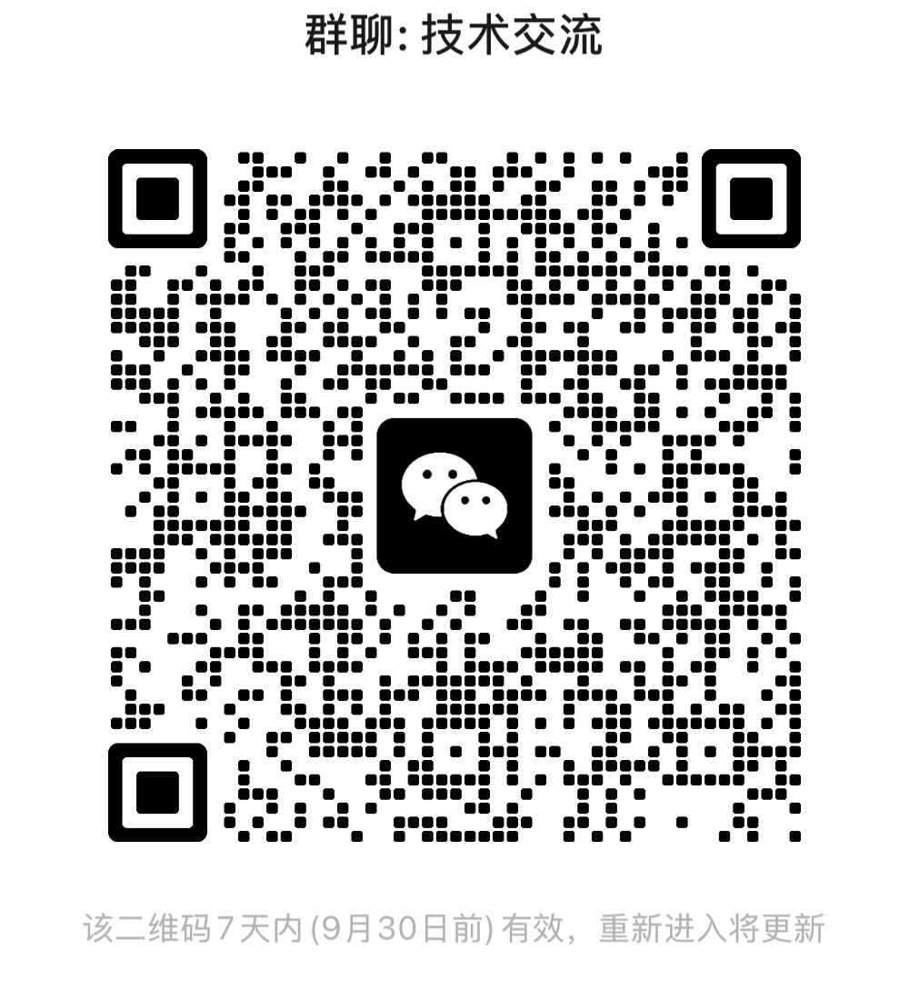

#### 待完成

1. 前端页面重构为uni-app

#### 代码运行

1. 将`utils/constant.js.example` 重命名为`constant.js`

2. `constant.js`里面配置后台接口地址和请求接口的`token`

#### 页面截图

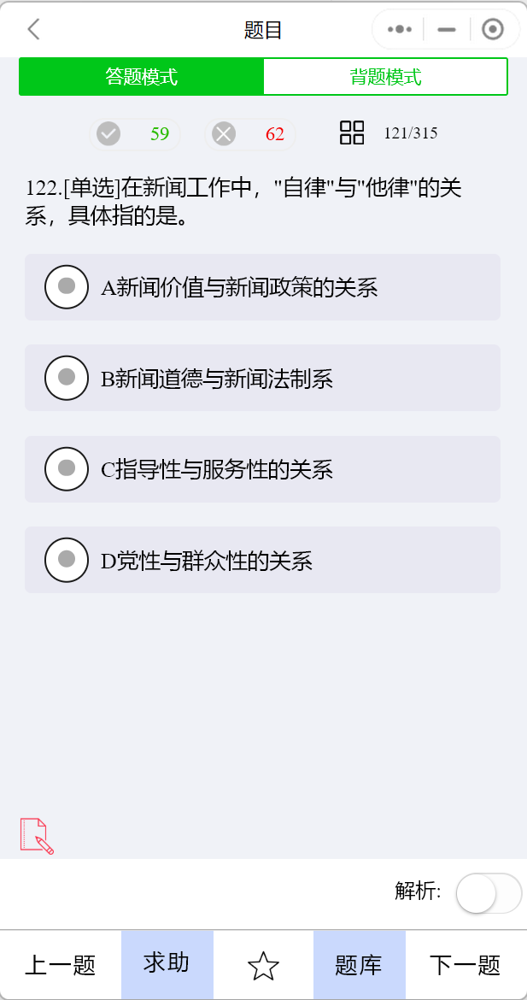

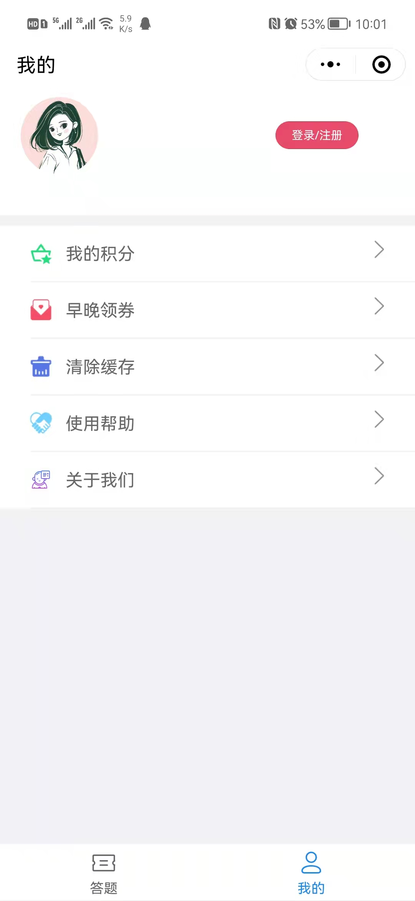
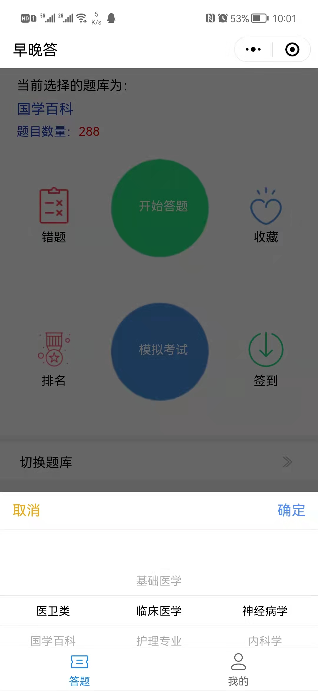
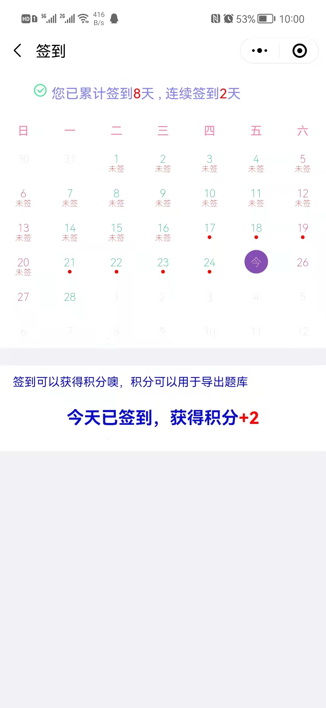
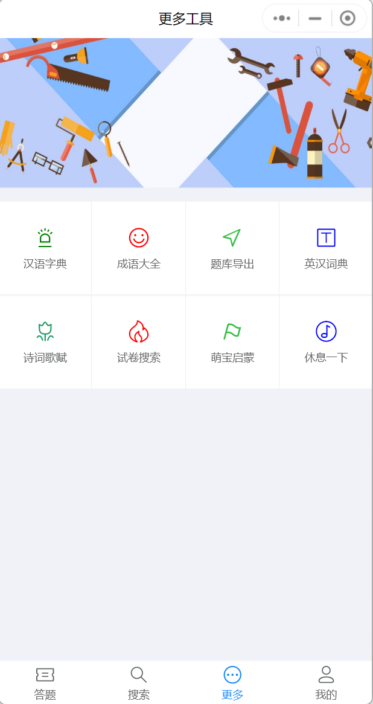

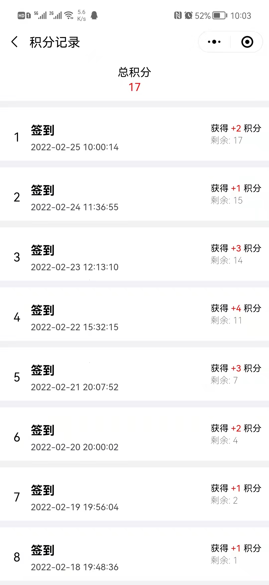

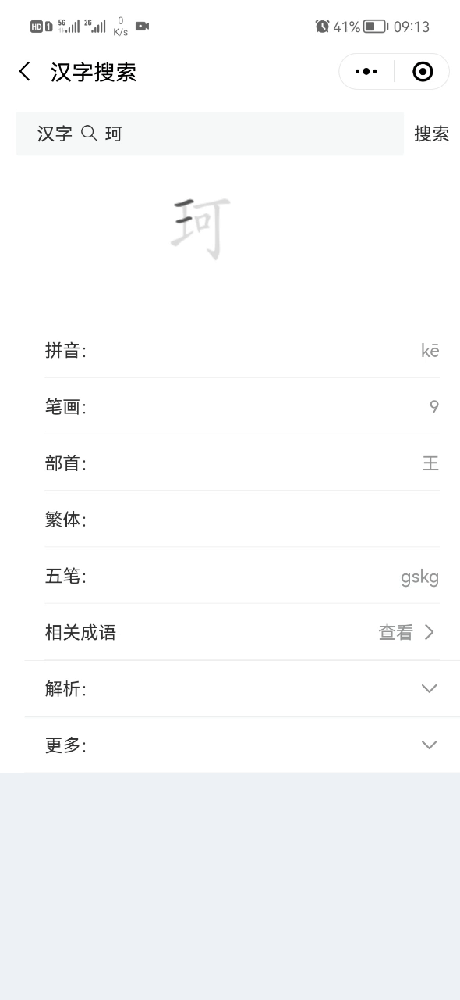

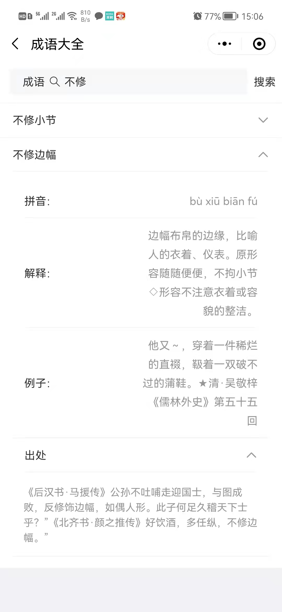

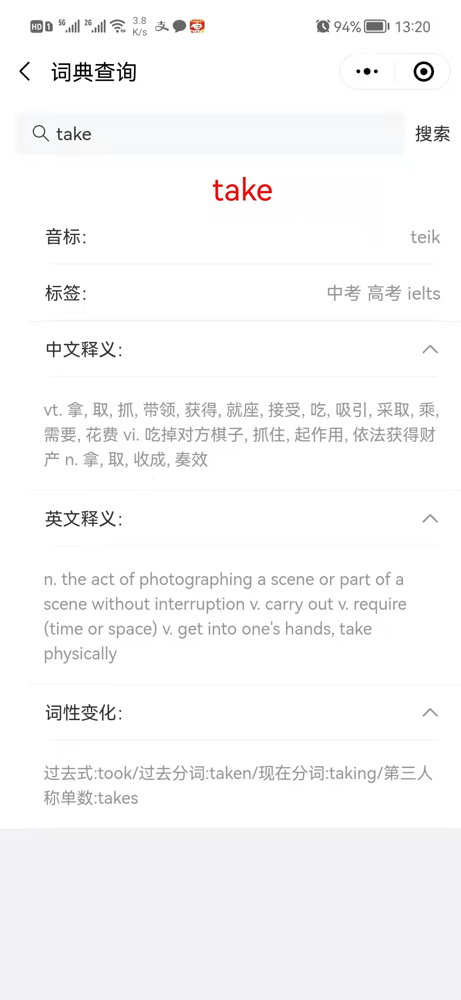

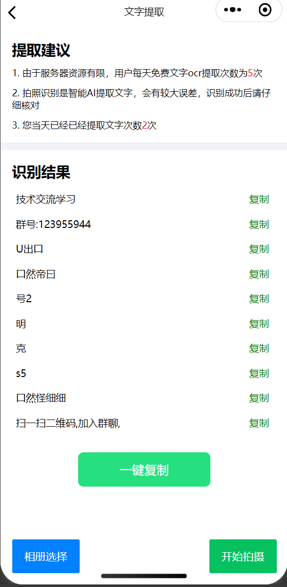

#### 后台截图

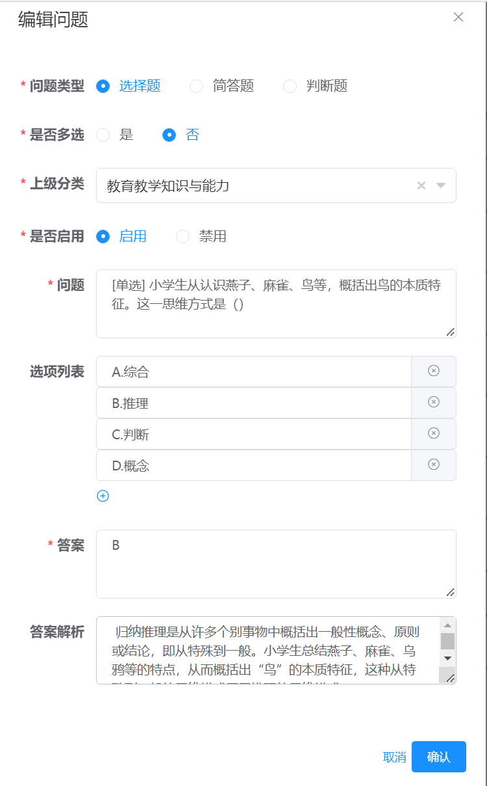

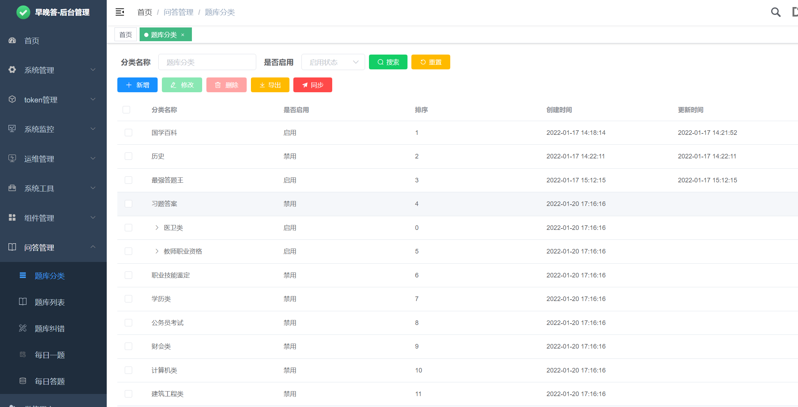

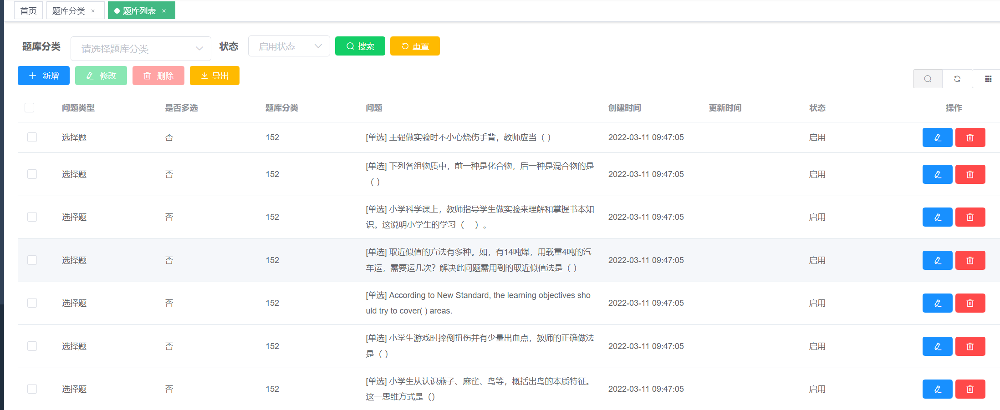

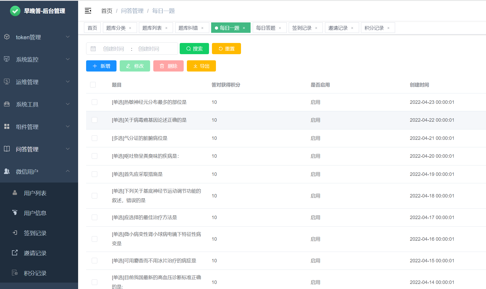

#### 参考项目

1. 汉字writer [https://github.com/chanind/hanzi-writer](https://github.com/chanind/hanzi-writer)

2. 汉字笔画write 小程序版 [https://github.com/chanind/hanzi-writer-miniprogram](https://github.com/chanind/hanzi-writer-miniprogram)

3. 日历插件 [https://github.com/treadpit/wx_calendar](https://github.com/treadpit/wx_calendar)

4. 抽奖大转盘 [https://github.com/xing00/wxapp-turn-table](https://github.com/xing00/wxapp-turn-table)

5. 三级联动 [https://github.com/z1511676208/chooseAddr](https://github.com/z1511676208/chooseAddr)

#### 赞赏项目

人都是要恰饭的。开源不易，请作者喝杯奶茶吧

微信赞赏

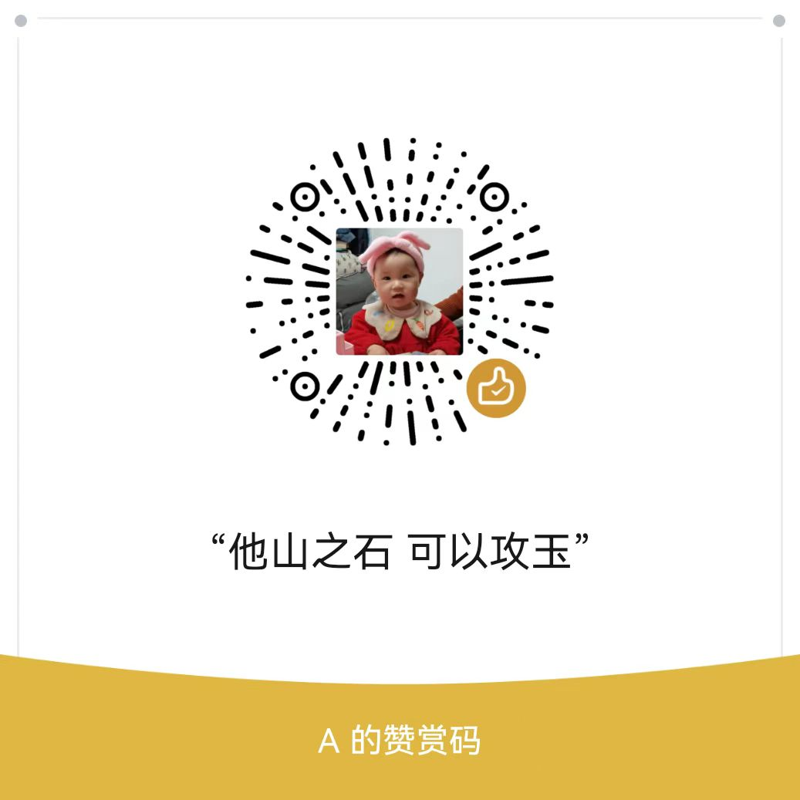

支付宝赞赏

